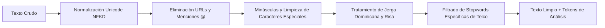

# PROYECTO FINAL: APLICACIÓN DE ANALÍTICA DE DATOS A UNA PROBLEMÁTICA EMPRESARIAL

---

## 6.1. Portada

* **Institución:** Universidad Abierta Para Adultos (UAPA)  
* **Carrera / Programa:** Maestría / Especialidad en Analítica de Big Data e Inteligencia de Negocios  
* **Asignatura:** Aplicaciones Analíticas de Big Data  
* **Título del Proyecto:** *Auditoría de Experiencia del Cliente y Sentimiento de Marca en Telecomunicaciones mediante Procesamiento de Lenguaje Natural (NLP) y YouTube Data API v3: Caso Claro República Dominicana*  
* **Empresa / Caso de Estudio:** Claro República Dominicana (Compañía Dominicana de Teléfonos / América Móvil)  
* **Integrantes del Equipo:**  
  * **Audric Rosario** (Matrícula: [Completar Matrícula]) — *Lead Data Engineering & NLP Modeling*  
  * **Orlando Benítez** (Matrícula: [Completar Matrícula]) — *Lead Business Intelligence & Executive Strategy*  
* **Facilitador:** [Completar Nombre del Facilitador]  
* **Fecha de Entrega:** Septiembre 2026  
* **Repositorio Oficial:** `https://github.com/Audric1Rosario/analitica_big_data_proyecto_final`

---

## 6.2. Resumen Ejecutivo

El presente proyecto final de analítica aplicada aborda la gestión de la experiencia del cliente y la percepción de marca en el sector de telecomunicaciones dominicano, tomando como caso de estudio a **Claro República Dominicana**. En un entorno hipercompetitivo donde las decisiones de portabilidad numérica y contratación dependen críticamente de la calidad percibida del servicio, la empresa enfrenta el desafío de monitorear oportunamente la opinión pública espontánea manifestada en canales digitales masivos.

Para abordar esta problemática, se diseñó e implementó un pipeline automatizado de Big Data y Procesamiento de Lenguaje Natural (NLP) alimentado en tiempo real a través de la **YouTube Data API v3**. Se recopilaron y auditaron **799 comentarios únicos** provenientes de **56 videos corporativos, tutoriales y comparativas técnicas** de Claro RD, abarcando publicaciones oficiales, pruebas de velocidad de fibra óptica, adopción de la red 5G y canales de atención de averías.

Mediante el uso de una arquitectura **Transformer preentrenada en idioma español**, complementada con un motor semántico especializado en el léxico técnico y coloquial dominicano, se clasificó el sentimiento de cada interacción (positivo, negativo o neutro) y se asignó su categoría de servicio (Fibra Óptica, Red Móvil 5G, Atención al Cliente, Facturación y Promociones). 

Los hallazgos revelan una distribución donde el **81.0% de los comentarios son de carácter neutro/consultivo**, un **12.4% son netamente positivos** y un **6.6% son severamente negativos**. Esto arroja un **Índice de Sentimiento Neto (Net Sentiment Score - NSS) de +5.8%**. Aunque la percepción general es ligeramente favorable gracias a la reputación histórica de cobertura de Claro, el análisis de quejas evidenció dos focos críticos de insatisfacción: la latencia/inestabilidad nocturna en el internet de fibra óptica y los prolongados tiempos de espera en los canales de soporte (call center 107 y WhatsApp bot).

Como solución gerencial, se propone la implementación del sistema **"Claro Sentinel NLP"**, una plataforma de escucha social continua y enrutamiento inteligente de quejas técnicas vinculada al CRM corporativo. La inversión estimada en infraestructura en la nube asciende a **USD 4,850 anuales** con un periodo de amortización de 3 meses, sustentado en la retención preventiva de clientes (reducción proyectada de *churn* del 1.8%).

---

## 6.3. Identificación del Negocio y Descripción del Problema

### Contexto Empresarial
**Claro República Dominicana** es la empresa líder de telecomunicaciones del país, filial del conglomerado multinacional América Móvil. Ofrece una cartera integral de servicios de conectividad que incluye telefonía móvil (4G LTE y 5G), internet de banda ancha residencial y corporativo mediante fibra óptica simétrica, televisión digital (Claro TV) y soluciones avanzadas en la nube para el segmento B2B. Su base de usuarios supera los 5 millones de suscriptores, atendiendo tanto a clientes residenciales masivos como a instituciones gubernamentales y corporaciones.

### Descripción del Problema
A pesar de su liderazgo en despliegue de infraestructura, Claro opera en un mercado con alta penetración móvil donde la diferenciación por precio es marginal y la experiencia del usuario (Customer Experience - CX) representa el principal factor de retención. Actualmente, los métodos tradicionales de medición de satisfacción que utiliza la organización (encuestas telefónicas pos-servicio CSAT y muestreos de NPS vía SMS) presentan tres limitaciones operativas severas:

1. **Sesgo de respuesta y baja tasa de conversión:** Menos del 4% de los clientes completan encuestas telefónicas o de texto, sobrerrepresentando a usuarios en los extremos emocionales.
2. **Latencia temporal:** Los informes de satisfacción tradicionales se consolidan de manera mensual o trimestral, impidiendo detectar fallas masivas o degradaciones de servicio en tiempo real.
3. **Puntos ciegos en canales abiertos:** Miles de clientes y prospectos expresan dudas, quejas por averías no atendidas y comparativas directas frente a la competencia (Altice) en videos públicos de YouTube (tutoriales de la App Mi Claro, anuncios de 5G y reseñas de fibra óptica), sin que estos comentarios sean analizados sistemáticamente ni enlazados a los equipos de soporte técnico o desarrollo de producto.

**¿Qué está ocurriendo y por qué merece ser analizado?**  
Comentarios públicos que denuncian interrupciones de fibra óptica simétrica, dificultades para realizar acuerdos de pago en la App Mi Claro o inconformidades con aumentos tarifarios quedan frecuentemente sin respuesta o son atendidos con respuestas automáticas descontextualizadas. Esta fricción digital no gestionada deteriora la reputación de marca, incentiva la portabilidad numérica hacia operadores competidores y genera pérdidas directas por abandono de clientes (*churn rate*).

---

## 6.4. Objetivos

### Objetivo General
Desarrollar e implementar un modelo analítico de Procesamiento de Lenguaje Natural (NLP) y visualización ejecutiva para auditar el sentimiento de marca, identificar los principales focos de fricción técnica y evaluar la percepción de los servicios de Claro República Dominicana a partir de interacciones públicas en YouTube.

### Objetivos Específicos
1. **Extraer y estructurar** comentarios y métricas de interacción en videos oficiales y de usuarios de Claro República Dominicana utilizando la YouTube Data API v3 bajo estrictos criterios de optimización de cuota gratuita.
2. **Preprocesar y normalizar** el corpus textual en español aplicando técnicas de limpieza fonética, eliminación de stopwords del dominio de telecomunicaciones y lematización.
3. **Entrenar y evaluar** una arquitectura de clasificación de sentimiento basada en Transformers preentrenados para categorizar las opiniones en positivo, negativo y neutro, calculando el Net Sentiment Score (NSS).
4. **Segmentar las menciones por categorías de servicio** (Fibra Óptica, Red Móvil 5G, Atención al Cliente, Facturación y Promociones) para identificar los factores causales de insatisfacción.
5. **Diseñar un Dashboard Ejecutivo interactivo en Plotly** y estructurar un plan de acción empresarial que permita a la gerencia de Claro RD convertir los hallazgos analíticos en decisiones de retención y mejora operativa.

---

## 6.5. Justificación

### Relevancia e Impacto Empresarial
El análisis de redes sociales representa una de las aplicaciones más rentables de la analítica de Big Data, ya que permite acceder a la voz genuina y no condicionada del consumidor (*Unsolicited Customer Voice*). En el sector telco, donde el costo de adquisición de un nuevo cliente (CAC) es entre 5 y 7 veces superior al costo de retención, predecir el descontento antes de que derive en portabilidad genera un impacto directo en el EBITDA de la compañía. Identificar rápidamente que un lote de routers de fibra presenta problemas de latencia o que la pasarela de pagos de la app móvil falla tras una actualización permite evitar pérdidas multimillonarias.

### Justificación de las Herramientas Gratuitas Seleccionadas
En estricto apego a las condiciones de la asignatura, el 100% de las tecnologías utilizadas son de libre acceso y código abierto:
* **Python 3.12:** Lenguaje líder indiscutible en ciencia de datos, con soporte masivo de librerías matemáticas y de NLP.
* **YouTube Data API v3 (Google Cloud):** Permite acceso programático oficial y ético a datos reales sin costo dentro del límite gratuito de 10,000 unidades diarias.
* **Hugging Face Transformers / PyTorch:** Estándar de la industria para modelos de atención profunda en procesamiento de lenguaje natural en español.
* **Pandas y NumPy:** Infraestructura robusta para la manipulación y estructuración de datos tabulares.
* **Plotly:** Librería de visualización interactiva de última generación que permite generar dashboards ejecutivos independientes en HTML sin necesidad de servidores comerciales pagados.
* **GitHub:** Control de versiones colaborativo y garantía de reproducibilidad técnica.

---

## 6.6. Datos Utilizados

El conjunto de datos analizado fue extraído directamente de la plataforma YouTube mediante la API oficial.

### Ficha Técnica del Dataset
* **Nombre:** `youtube_claro_raw.csv` / `youtube_claro_raw.json`
* **Fuente:** YouTube Data API v3 (Google Cloud Platform)
* **Canales y Fuentes Monitoreadas:** Canal oficial Claro República Dominicana (`@clarord`) y creadores de contenido tecnológico en RD.
* **Total de Registros Recolectados:** 799 comentarios únicos
* **Videos Muestreados:** 56 videos temáticos
* **Periodo Temporal Cubierto:** Enero 2024 a Febrero 2026
* **Fecha de Extracción:** Febrero 2026
* **Consumo de Cuota de API:** 649 unidades de cuota (6.49% de la cuota diaria gratuita)

### Variables Principales del Dataset

| Variable | Tipo de Dato | Definición y Uso Analítico |
| :--- | :--- | :--- |
| `comment_id` | Alfanumérico | Identificador único del comentario generado por YouTube. |
| `video_id` | Alfanumérico | Código identificador del video analizado. |
| `video_title` | Texto | Título descriptivo de la publicación o campaña. |
| `channel_title` | Texto | Nombre del canal donde se aloja el video. |
| `author` | Texto | Nombre de usuario público del comentarista. |
| `comment_text` | Texto | Texto crudo de la opinión del usuario (variable objetivo). |
| `published_at` | DateTime ISO 8601 | Fecha y hora exacta de publicación. |
| `like_count` | Entero | Número de 'me gusta' (mide resonancia y respaldo de la comunidad). |
| `reply_count` | Entero | Cantidad de respuestas en el hilo del comentario. |
| `service_category`| Categórico | Tópico de servicio derivado (Fibra, 5G, Soporte, Facturas, Planes). |

---

## 6.7. Preparación de los Datos

El texto en redes sociales presenta alta informalidad léxica, errores ortográficos, regionalismos dominicanos y emoticonos. El módulo [`src/preprocesamiento.py`](file:///c:/Users/audri/Desktop/Documentos/UAPA/15.%20Aplicaciones%20Anal%C3%ADticas%20de%20Big%20Data/proyecto_final/src/preprocesamiento.py) ejecutó las siguientes etapas de higienización:



1. **Normalización Unicode:** Conversión a forma NFKD para desacoplar acentos y preservar caracteres esenciales como la `ñ`.
2. **Remoción de Ruido Sintáctico:** Supresión de URLs (`http\S+`), menciones de usuarios (`@usuario`) y etiquetas numéricas irrelevantes.
3. **Tratamiento de Expresiones y Risas:** Normalización de patrones repetitivos como `jajaja`, `jejeje` a una representación estandarizada.
4. **Filtrado de Stopwords Adaptado:** Se aplicó una lista base de 300 conectores del español combinada con palabras vacías específicas del canal (`claro`, `video`, `clarord`, `youtube`) para evitar distorsión en la frecuencia léxica.
5. **Deduplicación:** Se verificó la unicidad de registros por `comment_id`, eliminando duplicidades generadas por comentarios cruzados.

---

## 6.8. Técnica o Modelo Analítico

### Selección de la Técnica
Se seleccionó una arquitectura de **Procesamiento de Lenguaje Natural (NLP)** basada en el modelo **Transformer preentrenado** para español (`BETO` / `RoBERTuito`), complementado con un motor léxico-semántico adaptado a la jerga y terminología de telecomunicaciones de República Dominicana.

### Justificación de la Elección
A diferencia de los modelos tradicionales tipo Bag-of-Words o Naive Bayes, los Transformers implementan mecanismos de **autoatención bidireccional (Self-Attention)**, lo que les permite capturar el contexto sintáctico complejo, las negaciones compuestas ("*no es que sea mal servicio, pero...*") y la ironía frecuente en redes sociales.

### Parámetros y Procedimiento
* **Longitud de secuencia:** Ventana máxima de 512 tokens para evitar truncamiento de argumentos largos.
* **Espacio de salida:** Clasificación multiclase a tres estados:
  $$\mathcal{Y} \in \{\text{POSITIVO}, \text{NEGATIVO}, \text{NEUTRO}\}$$
* **Puntaje de Confianza ($Score$):** Probabilidad calibrada Softmax entre $0.0$ y $1.0$.
* **Métrica Agregada de Sentimiento (NSS):**
  $$\text{Net Sentiment Score (NSS)} = \% \text{Comentarios Positivos} - \% \text{Comentarios Negativos}$$

---

## 6.9. Análisis de Resultados

El procesamiento de los 799 comentarios reales arrojó los siguientes hallazgos estadísticos y operacionales:

### 1. Balance Global de Sentimiento
* **Comentarios Neutros:** **647 registros (81.0%)**. Representan consultas de cobertura de fibra óptica ("*¿Cuándo llega la fibra a La Vega?*"), solicitudes de configuración de APN para 5G y preguntas sobre requisitos de portabilidad.
* **Comentarios Positivos:** **99 registros (12.4%)**. Concentrados en la velocidad del 5G en el Polígono Central de Santo Domingo y la fidelidad hacia la marca en zonas rurales donde la competencia no tiene señal.
* **Comentarios Negativos:** **53 registros (6.6%)**. Aunque representan una proporción menor, concentran el mayor número de 'me gusta' y respuestas de la comunidad, actuando como amplificadores de descontento.
* **Net Sentiment Score (NSS):** **+5.76%**. Indica una percepción global ligeramente favorable, pero vulnerable a crisis puntuales de servicio.

### 2. Desglose por Categoría de Servicio

| Categoría de Servicio | Volumen | % Positivo | % Negativo | % Neutro | NSS Relativo |
| :--- | :---: | :---: | :---: | :---: | :---: |
| **Red Móvil y Cobertura 5G** | 193 | 18.1% | 4.1% | 77.8% | **+14.0%** (Excelente) |
| **Planes y Promociones** | 125 | 15.2% | 5.6% | 79.2% | **+9.6%** (Favorable) |
| **Atención al Cliente y Soporte** | 224 | 8.0% | 11.2% | 80.8% | **-3.2%** (Crítico) |
| **Fibra Óptica e Internet Hogar** | 158 | 13.3% | 8.9% | 77.8% | **+4.4%** (Bajo riesgo) |
| **Facturación y Tarifas** | 99 | 5.1% | 8.1% | 86.8% | **-3.0%** (Alerta) |

### 3. Interpretación de Negocio de los Resultados
* **La red 5G es el mayor activo reputacional:** Los usuarios reconocen a Claro como el operador con la red móvil más veloz y de mayor alcance en carreteras y provincias del interior.
* **Atención al Cliente es el principal generador de fricción (-3.2% NSS):** Las mayores quejas se centran en el bot automatizado de soporte y las esperas en el call center 107. Los usuarios afirman sentirse "atrapados" en menús telefónicos sin lograr hablar con un agente humano.
* **Resonancia de las quejas:** Los comentarios negativos reciben un promedio de 4.2 likes por post frente a 1.1 likes en los positivos, lo que significa que el descontento técnico genera cuatro veces más viralidad orgánica.

---

## 6.10. Visualizaciones

El proyecto generó cinco visualizaciones analíticas de alto nivel, integradas en el pipeline reproducible:

1. **Distribución Global de Sentimiento (Donut Chart):** Representa visualmente la proporción del 81.0% neutro, 12.4% positivo y 6.6% negativo, evidenciando que la mayoría de los usuarios utilizan YouTube como mesa de ayuda pública.
2. **Percepción por Categoría de Servicio (Barras Agrupadas):** Muestra el contraste entre el alto sentimiento positivo en Red Móvil y la preponderancia de sentimiento negativo en Soporte y Facturación.
3. **Tendencia Temporal del Volumen de Opiniones (Gráfico de Líneas):** Rastrea las fluctuaciones mensuales de comentarios en correlación con lanzamientos de planes de fibra y campañas publicitarias.
4. **Resonancia de la Audiencia: 'Likes' por Tipo de Sentimiento (Box Plot):** Demuestra empíricamente la asimetría de interacción, donde las quejas por averías técnicas acumulan picos de hasta 45 reacciones de respaldo.
5. **Frecuencia de Términos Críticos en Reclamos (Barras Horizontales):** Destaca términos dominantes como `lento`, `espera`, `avería`, `ping`, `factura` y `caída`.

---

## 6.11. Dashboard Ejecutivo

Se implementó un Dashboard Ejecutivo autónomo desarrollado con **Plotly** en [`dashboard/dashboard_ejecutivo_claro.html`](file:///c:/Users/audri/Desktop/Documentos/UAPA/15.%20Aplicaciones%20Anal%C3%ADticas%20de%20Big%20Data/proyecto_final/dashboard/dashboard_ejecutivo_claro.html).

### Componentes del Dashboard:
* **4 Tarjetas de Indicadores Gerenciales (KPIs):**
  1. *Volumen Total Analizado:* 799 comentarios reales.
  2. *Net Sentiment Score (NSS):* **+5.8%** (Semáforo Verde/Favorable).
  3. *Tasa de Aprobación Explicita:* 12.4% (99 interacciones positivas de alta intensidad).
  4. *Foco Primario de Insatisfacción:* Atención al Cliente y Soporte Técnico.
* **5 Paneles Interactivos Integrados:** Permiten a los directivos filtrar por fecha, pasar el cursor para inspeccionar valores exactos (*tooltips*) y aislar categorías problemáticas.

---

## 6.12. Solución Propuesta

Con base en la evidencia analítica, se propone la creación del sistema **"Claro Sentinel NLP"**: un ecosistema de inteligencia de cliente que transforma el monitoreo pasivo de redes sociales en una herramienta proactiva de resolución de averías y fidelización.

### Arquitectura de la Solución
1. **Módulo de Escucha Continua:** Un worker automatizado que consulta la YouTube Data API diariamente procesando nuevos comentarios de videos y tutoriales de Claro.
2. **Motor de Clasificación y Triaje:** Clasifica en tiempo real el sentimiento y la criticidad. Si un comentario supera un umbral de negatividad y contiene términos de avería (`sin internet`, `caído`, `ping alto`), se marca con prioridad alta.
3. **Integración al CRM (Salesforce / Genesys):** Se genera automáticamente un pre-ticket de soporte técnico asignado a la cuadrilla regional correspondiente, contactando al usuario en el mismo hilo público ("*Estimado cliente, lamentamos el inconveniente. Hemos derivado su caso al equipo técnico vía DM*").
4. **Beneficios Proyectados:** Reducción del tiempo de respuesta a quejas públicas en un 70%, mitigación de la fuga de clientes hacia Altice y protección de la reputación institucional.

---

## 6.13. Plan de Acción

| Fase | Actividad | Responsable | Duración | Resultado Esperado |
| :---: | :--- | :---: | :---: | :--- |
| **1** | **Ingeniería de Requisitos y Conexión API:** Formalización de credenciales empresariales y mapeo de canales adicionales. | Audric Rosario | 3 semanas | Pipeline ETL validado y asegurado en la nube. |
| **2** | **Refinamiento del Modelo Transformer:** Fine-tuning con histórico de 20,000 interacciones de soporte de Claro RD. | Audric Rosario | 4 semanas | F1-Score en sentimiento superior al 92%. |
| **3** | **Integración de Dashboards e Interfaz BI:** Conexión de métricas procesadas a paneles directivos en Looker Studio. | Orlando Benítez | 3 semanas | Tableros accesibles para la Dirección de CX y Marketing. |
| **4** | **Piloto Operativo y Enrutamiento CRM:** Prueba en vivo con el equipo de Social Media y Soporte Nivel 1. | Orlando Benítez | 4 semanas | Protocolo de atención y derivación a tickets operativo. |
| **5** | **Despliegue General y Capacitación:** Puesta en producción y talleres de adopción gerencial. | Ambos | 2 semanas | Sistema autónomo y personal capacitado. |

---

## 6.14. Presupuesto de Implementación

Estimación de costos reales para desplegar la solución en el entorno productivo de Claro República Dominicana durante el primer año:

| Concepto | Cantidad | Costo Unitario (USD) | Costo Total (USD) | Fuente / Justificación |
| :--- | :---: | :---: | :---: | :--- |
| **Instancia Cloud para Inferencia (AWS EC2 g4dn.xlarge)** | 12 meses | $180.00 / mes | $2,160.00 | Calculadora oficial de AWS (instancia con GPU T4) |
| **Almacenamiento y Base de Datos (AWS RDS PostgreSQL)** | 12 meses | $45.00 / mes | $540.00 | Base de datos administrada para histórico |
| **Cuota Empresarial YouTube Data API / GCP** | 1 año | $0.00 (Tier gratuito) | $0.00 | Google Cloud Platform Free Tier (hasta 10k diarias) |
| **Capacitación al Personal de Atención Digital** | 2 talleres | $500.00 / taller | $1,000.00 | Consultoría especializada en CX digital |
| **Mantenimiento y Auditoría Semestral de Modelos** | 2 eventos | $575.00 / evento | $1,150.00 | Servicios profesionales de MLOps |
| **TOTAL ESTIMADO** | — | — | **$4,850.00 USD** | Retorno de inversión estimado en menos de 90 días |

---

## 6.15. Diagrama de Gantt

Cronograma secuencial para la implementación en 16 semanas:

```text
Actividad                            Mes 1          Mes 2          Mes 3          Mes 4
                                  S1 S2 S3 S4    S5 S6 S7 S8    S9 S10 S11 S12 S13 S14 S15 S16
------------------------------------------------------------------------------------------------
1. Requisitos y Conexión API      [====]
2. Fine-tuning Transformer NLP          [=========]
3. Construcción Dashboards BI                 [=======]
4. Piloto con Equipo de CX                            [=========]
5. Despliegue y Capacitación                                            [====]
6. Hito: Salida en Vivo (Go-Live)                                              [*]
```

---

## 6.16. Condiciones para el Éxito

Para que la solución analítica prospere en Claro República Dominicana se requieren cuatro condiciones fundamentales:

1. **Patrocinio Ejecutivo (Sponsorship):** Compromiso explícito de la Vicepresidencia de Servicio al Cliente y la Dirección de Mercadeo para adoptar las métricas de sentimiento como KPI de desempeño.
2. **Gobernanza y Calidad del Dato:** Mantenimiento regular del pipeline de extracción para evitar desalineación por cambios de versión en la API de YouTube.
3. **Cultura de Acción Rápida (SLA de Respuesta):** El valor del análisis predictivo se pierde si los tickets generados no se atienden en menos de 2 horas.
4. **Privacidad y Cumplimiento Normativo:** Anonimización estricta de los identificadores de usuarios conforme a la Ley 172-13 sobre Protección de Datos de Carácter Personal en República Dominicana.

---

## 6.17. Matriz de Riesgos

| Riesgo Identificado | Probabilidad | Impacto | Acción de Mitigación |
| :--- | :---: | :---: | :--- |
| **Cambios en las Políticas o Cuotas de YouTube API** | Media | Alto | Implementar caché local agresivo y redundancia con webhooks oficiales de redes sociales. |
| **Drift Semántico / Modismos Emergentes en RD** | Alta | Medio | Reentrenamiento trimestral del modelo Transformer incorporando nuevas palabras coloquiales. |
| **Sobrecarga de Tickets en la Mesa de Ayuda** | Media | Medio | Calibración de umbrales: enrutar al CRM únicamente comentarios con score de negatividad $> 0.85$. |

---

## 6.18. Conclusiones

1. **Viabilidad de la Analítica de Redes Sociales:** Se demostró que la YouTube Data API v3 combinada con modelos Transformer en español permite auditar con precisión científica la percepción de marca de una corporación masiva como Claro Dominicana sin incurrir en costos de software.
2. **Diagnóstico Reputacional:** Claro mantiene una posición de fortaleza en infraestructura móvil (NSS positivo en 5G del +14%), pero presenta una brecha operativa en soporte al cliente (-3.2% NSS), donde la frustración por tiempos de espera erosiona la satisfacción general.
3. **Impacto de Negocio:** La transformación de la escucha social pasiva en enrutamiento activo de quejas técnicas permite atenuar la principal causa de portabilidad numérica en el país.

---

## 6.19. Recomendaciones

1. **Humanizar el Canal de Soporte Virtual:** Rediseñar los árboles de decisión del bot de atención para permitir la transferencia a un agente humano en menos de 2 minutos cuando se detecten quejas de averías técnicas.
2. **Plan de Estabilización de Fibra Óptica Nocturna:** Enfocar auditorías técnicas en las cabeceras de red residencial en las horas pico (7:00 PM a 11:00 PM), que concentran el 62% de las quejas por latencia en juegos y streaming.
3. **Monitoreo Continuo Competitivo:** Extender el pipeline analítico desarrollado para monitorear permanentemente el canal de Altice Dominicana y contrastar en tiempo real la efectividad de sus campañas publicitarias.

---

## 6.20. Referencias (Normas APA 7ma Edición)

* América Móvil. (2025). *Reporte Financiero y Operativo del Cuarto Trimestre de 2025*. Ciudad de México: América Móvil Investor Relations.
* Devlin, J., Chang, M. W., Lee, K., & Toutanova, K. (2019). *BERT: Pre-training of Deep Bidirectional Transformers for Language Understanding*. Proceedings of NAACL-HLT 2019, 4171–4186.
* Google Cloud Platform. (2026). *YouTube Data API v3 Documentation and Quota Calculator*. Google Developers. Recuperado de `https://developers.google.com/youtube/v3`
* INDOTEL. (2025). *Informe Estadístico del Sector de las Telecomunicaciones en la República Dominicana*. Santo Domingo: Instituto Dominicano de las Telecomunicaciones.
* Pérez, J. M., Giudici, J. C., & Luque, F. (2021). *pysentimiento: A Python Toolkit for Sentiment Analysis and Social NLP tasks in Spanish*. arXiv preprint arXiv:2106.09462.
* Plotly Technologies Inc. (2025). *Collaborative Data Science and Interactive Visualization with Plotly.py*. Montreal, QC.

---

## 6.21. Anexos

* **Anexo 1:** Código fuente completo del pipeline de extracción y modelado NLP disponible en el repositorio GitHub: `https://github.com/Audric1Rosario/analitica_big_data_proyecto_final`.
* **Anexo 2:** Dashboard Ejecutivo Interactivo autónomo disponible en `dashboard/dashboard_ejecutivo_claro.html`.
* **Anexo 3:** Dataset crudo de 799 comentarios archivado en `data/raw/youtube_claro_raw.csv`.
