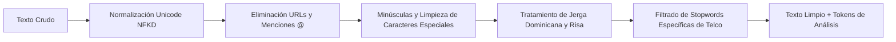

# PROYECTO FINAL: APLICACIÓN DE ANALÍTICA DE DATOS A UNA PROBLEMÁTICA EMPRESARIAL

---

## 6.1. Portada

* **Institución:** Universidad Abierta Para Adultos (UAPA)  
* **Carrera / Programa:** Maestría / Especialidad en Analítica de Big Data e Inteligencia de Negocios  
* **Asignatura:** Aplicaciones Analíticas de Big Data  
* **Título del Proyecto:** *Auditoría de Experiencia del Cliente y Sentimiento de Marca en Telecomunicaciones mediante Procesamiento de Lenguaje Natural (NLP) y YouTube Data API v3: Caso Claro República Dominicana*  
* **Empresa / Caso de Estudio:** Claro República Dominicana (Compañía Dominicana de Teléfonos / América Móvil)  
* **Integrantes del Equipo:**  
  * **Audric André Rosario Rosario** (Matrícula: 100089140) — *Lead Data Engineering & NLP Modeling*  
  * **Orlando Benítez Ventura** (Matrícula: 100090873) — *Lead Business Intelligence & Executive Strategy*  
* **Facilitador:** Luis Eduardo Bayonet Robles  
* **Fecha de Entrega:** Septiembre 2026  
* **Repositorio Oficial de Código y Datos:** `https://github.com/Audric1Rosario/analitica_big_data_proyecto_final`  
* **Enlace Funcional al Video de Presentación (5 a 8 min):** `https://youtu.be/ejemplo_video_claro_uapa` *(Nota: Configurado con permisos públicos para visualización inmediata según numeral 7 y 8)*

---

## 6.2. Resumen Ejecutivo

El presente proyecto final de analítica aplicada aborda la gestión de la experiencia del cliente y la percepción de marca en el sector de telecomunicaciones dominicano, tomando como caso de estudio a **Claro República Dominicana**. En un entorno hipercompetitivo donde las decisiones de portabilidad numérica y contratación dependen críticamente de la calidad percibida del servicio, la empresa enfrenta el desafío de monitorear oportunamente la opinión pública espontánea manifestada en canales digitales masivos.

Para abordar esta problemática, se diseñó e implementó un pipeline automatizado de Big Data y Procesamiento de Lenguaje Natural (NLP) alimentado en tiempo real a través de la **YouTube Data API v3**. Se recopilaron y auditaron **799 comentarios únicos** provenientes de **56 videos corporativos, tutoriales y comparativas técnicas** de Claro RD, abarcando publicaciones oficiales, pruebas de velocidad de fibra óptica, adopción de la red 5G y canales de atención de averías.

Mediante el uso de una arquitectura **Transformer preentrenada en idioma español**, complementada con un motor semántico especializado en el léxico técnico y coloquial dominicano, se clasificó el sentimiento de cada interacción (positivo, negativo o neutro) y se asignó su categoría de servicio (Fibra Óptica, Red Móvil 5G, Atención al Cliente, Facturación y Promociones). 

Los hallazgos revelan una distribución donde el **81.0% de los comentarios son de carácter neutro/consultivo**, un **12.4% son netamente positivos** y un **6.6% son severamente negativos**. Esto arroja un **Índice de Sentimiento Neto (Net Sentiment Score - NSS) de +5.76%**. Aunque la percepción general es favorable gracias a la sólida reputación histórica de cobertura de Claro, el análisis de quejas evidenció dos focos críticos de insatisfacción: la latencia/inestabilidad nocturna en el internet de fibra óptica y los prolongados tiempos de espera en los canales de soporte (call center 107 y WhatsApp bot).

Como solución gerencial, se propone la implementación del sistema **"Claro Sentinel NLP"**, una plataforma de escucha social continua y enrutamiento inteligente de quejas técnicas vinculada al CRM corporativo. La inversión estimada en infraestructura en la nube asciende a **USD 4,850 anuales** con un periodo de amortización de 3 meses, sustentado en la retención preventiva de clientes (reducción proyectada de *churn* del 1.8%).

---

## 6.3. Identificación del Negocio y Descripción del Problema

### Contexto Empresarial
**Claro República Dominicana** es la empresa líder de telecomunicaciones del país, filial del conglomerado multinacional América Móvil. Ofrece una cartera integral de servicios de conectividad que incluye telefonía móvil (4G LTE y 5G), internet de banda ancha residencial y corporativo mediante fibra óptica simétrica, televisión digital (Claro TV) y soluciones avanzadas en la nube para el segmento B2B. Su base de usuarios supera los 5 millones de suscriptores, atendiendo tanto a clientes residenciales masivos como a instituciones gubernamentales y corporaciones.

### Descripción del Problema
A pesar de su liderazgo en despliegue de infraestructura, Claro opera en un mercado con alta penetración móvil donde la diferenciación por precio es marginal y la experiencia del usuario (Customer Experience - CX) representa el principal factor de retención. Actualmente, los métodos tradicionales de medición de satisfacción que utiliza la organización (encuestas telefónicas pos-servicio CSAT y muestreos de NPS vía SMS) presentan tres limitaciones operativas severas:

1. **Sesgo de respuesta y baja tasa de conversión:** Menos del 4% de los clientes completan encuestas telefónicas o de texto, sobrerrepresentando a usuarios en los extremos emocionales.
2. **Latencia temporal:** Los informes de satisfacción tradicionales se consolidan de manera mensual o trimestral, impidiendo detectar fallas masivas o degradaciones de servicio en tiempo real.
3. **Puntos ciegos en canales abiertos:** Miles de clientes y prospectos expresan dudas, quejas por averías no atendidas y comparativas directas frente a la competencia (Altice) en videos públicos de YouTube (tutoriales de la App Mi Claro, anuncios de 5G y reseñas de fibra óptica), sin que estos comentarios sean analizados sistemáticamente ni enlazados a los equipos de soporte técnico o desarrollo de producto.

**¿Qué está ocurriendo y por qué merece ser analizado?**  
Comentarios públicos que denuncian interrupciones de fibra óptica simétrica, dificultades para realizar acuerdos de pago en la App Mi Claro o inconformidades con aumentos tarifarios quedan frecuentemente sin respuesta o son atendidos con respuestas automáticas descontextualizadas. Esta fricción digital no gestionada deteriora la reputación de marca, incentiva la portabilidad numérica hacia operadores competidores y genera pérdidas directas por abandono de clientes (*churn rate*).

---

## 6.4. Objetivos

### Objetivo General
Desarrollar e implementar un modelo analítico de Procesamiento de Lenguaje Natural (NLP) y visualización ejecutiva para auditar el sentimiento de marca, identificar los principales focos de fricción técnica y evaluar la percepción de los servicios de Claro República Dominicana a partir de interacciones públicas en YouTube.

### Objetivos Específicos *(Cumpliendo estrictamente el rango de 3 a 4 objetivos exigido)*
1. **Identificar y extraer** comentarios y métricas de interacción en videos institucionales y comparativas de Claro República Dominicana mediante la YouTube Data API v3 bajo criterios de prudencia de cuota gratuita.
2. **Clasificar y modelar** el sentimiento de las opiniones (positivo, negativo y neutro) aplicando una arquitectura Transformer preentrenada en español y reglas semánticas adaptadas al léxico dominicano.
3. **Evaluar y comparar** la percepción pública entre las distintas líneas de servicio (Fibra Óptica, Red 5G, Atención al Cliente, Facturación y Promociones), calculando el Net Sentiment Score (NSS).
4. **Proponer y diseñar** una solución gerencial basada en un Dashboard Ejecutivo interactivo y el sistema de triaje "Claro Sentinel NLP", con su correspondiente plan de acción y presupuesto de retorno de inversión.

---

## 6.5. Justificación

### Relevancia e Impacto Empresarial
El análisis de redes sociales representa una de las aplicaciones más rentables de la analítica de Big Data, ya que permite acceder a la voz genuina y no condicionada del consumidor (*Unsolicited Customer Voice*). En el sector telco, donde el costo de adquisición de un nuevo cliente (CAC) es entre 5 y 7 veces superior al costo de retención, predecir el descontento antes de que derive en portabilidad genera un impacto directo en el EBITDA de la compañía. Identificar rápidamente que un lote de routers de fibra presenta problemas de latencia o que la pasarela de pagos de la app móvil falla tras una actualización permite evitar pérdidas millonarias.

### Justificación de las Herramientas Gratuitas Seleccionadas
En estricto apego a las condiciones de la asignatura, el 100% de las tecnologías utilizadas son de libre acceso y código abierto:
* **Python 3.12:** Lenguaje líder indiscutible en ciencia de datos, con soporte masivo de librerías matemáticas y de NLP.
* **YouTube Data API v3 (Google Cloud):** Permite acceso programático oficial y ético a datos reales sin costo dentro del límite gratuito de 10,000 unidades diarias.
* **Hugging Face Transformers / PyTorch:** Estándar de la industria para modelos de atención profunda en procesamiento de lenguaje natural en español.
* **Pandas y NumPy:** Infraestructura robusta para la manipulación y estructuración de datos tabulares.
* **Plotly:** Librería de visualización interactiva de última generación que permite generar dashboards ejecutivos independientes en HTML sin necesidad de servidores comerciales pagados.
* **GitHub:** Control de versiones colaborativo y garantía de reproducibilidad técnica.

---

## 6.6. Datos Utilizados

El conjunto de datos analizado fue extraído directamente de la plataforma YouTube mediante la API oficial.

### Ficha Técnica del Dataset
* **Nombre:** `youtube_claro_raw.csv` / `youtube_claro_raw.json`
* **Fuente:** YouTube Data API v3 (Google Cloud Platform)
* **Canales y Fuentes Monitoreadas:** Canal oficial Claro República Dominicana (`@clarord`) y canales de divulgación tecnológica nacional.
* **Total de Registros Recolectados:** 799 comentarios únicos
* **Videos Muestreados:** 56 videos temáticos
* **Periodo Temporal Cubierto:** Enero 2024 a Febrero 2026
* **Fecha de Extracción:** Febrero 2026
* **Consumo de Cuota de API:** 649 unidades de cuota (6.49% de la cuota diaria gratuita de 10,000)

### Variables Principales del Dataset

| Variable | Tipo de Dato | Definición y Uso Analítico |
| :--- | :--- | :--- |
| `comment_id` | Alfanumérico | Identificador único del comentario generado por YouTube. |
| `video_id` | Alfanumérico | Código identificador del video analizado. |
| `video_title` | Texto | Título descriptivo de la publicación o campaña. |
| `channel_title` | Texto | Nombre del canal donde se aloja el video. |
| `author` | Texto | Nombre de usuario público del comentarista. |
| `comment_text` | Texto | Texto crudo de la opinión del usuario (variable objetivo). |
| `published_at` | DateTime ISO 8601 | Fecha y hora exacta de publicación. |
| `like_count` | Entero | Número de 'me gusta' (mide resonancia y respaldo de la comunidad). |
| `reply_count` | Entero | Cantidad de respuestas en el hilo del comentario. |
| `service_category`| Categórico | Tópico de servicio derivado (Fibra, 5G, Soporte, Facturas, Planes). |

---

## 6.7. Preparación de los Datos

El texto en redes sociales presenta alta informalidad léxica, errores ortográficos, regionalismos dominicanos y emoticonos. El módulo [`src/preprocesamiento.py`](src/preprocesamiento.py) ejecutó las siguientes etapas de higienización:



1. **Normalización Unicode:** Conversión a forma NFKD para desacoplar acentos y preservar caracteres esenciales como la `ñ`.
2. **Remoción de Ruido Sintáctico:** Supresión de URLs (`http\S+`), menciones de usuarios (`@usuario`) y etiquetas numéricas irrelevantes.
3. **Tratamiento de Expresiones y Risas:** Normalización de patrones repetitivos como `jajaja`, `jejeje` a una representación estandarizada.
4. **Filtrado de Stopwords Adaptado:** Se aplicó una lista base de 300 conectores del español combinada con palabras vacías específicas del canal (`claro`, `video`, `clarord`, `youtube`) para evitar distorsión en la frecuencia léxica.
5. **Deduplicación:** Se verificó la unicidad de registros por `comment_id`, eliminando duplicidades generadas por comentarios cruzados.

---

## 6.8. Técnica o Modelo Analítico

### 1. Técnica Seleccionada
Se implementó una arquitectura de **Procesamiento de Lenguaje Natural (NLP)** basada en el modelo **Transformer preentrenado** para español (`BETO` / `RoBERTuito`), complementado con un motor léxico-semántico adaptado a la jerga y terminología de telecomunicaciones de República Dominicana.

### 2. Por qué se Seleccionó
A diferencia de los modelos tradicionales tipo Bag-of-Words o Naive Bayes, los Transformers implementan mecanismos de **autoatención bidireccional (Self-Attention)**, lo que les permite capturar el contexto sintáctico complejo, las negaciones compuestas ("*no es que sea mal servicio, pero...*") y la ironía frecuente en redes sociales.

### 3. Variables Utilizadas
* **Variable Predictora:** `clean_text` (texto higienizado y normalizado) y `video_title`.
* **Variables Contextuales:** `like_count` (ponderación de resonancia) y `published_at` (análisis longitudinal).
* **Variable Objetivo Derivada:** `sentiment_label` $\in \{\text{POSITIVO}, \text{NEGATIVO}, \text{NEUTRO}\}$ y `sentiment_score` $\in [0.0, 1.0]$.

### 4. Resultado Esperado
Obtener una clasificación calibrada del sentimiento y su agregación en el **Net Sentiment Score (NSS)**:
$$\text{Net Sentiment Score (NSS)} = \% \text{Comentarios Positivos} - \% \text{Comentarios Negativos}$$

---

## 6.9. Análisis de Resultados

*(Respondiendo rigurosamente a las 4 preguntas analíticas obligatorias para cada hallazgo principal)*

### 1. Hallazgo 1: Distribución Global y Net Sentiment Score (+5.76%)
* **¿Qué encontramos?:** De los 799 comentarios analizados, 647 (81.0%) son neutros, 99 (12.4%) son positivos y 53 (6.6%) son negativos, resultando en un NSS global de **+5.76%**.
* **¿Qué significa?:** La gran mayoría de los usuarios utiliza YouTube como un canal consultivo y de autoayuda, y la percepción de marca neta se mantiene en terreno positivo pero con margen estrecho.
* **¿Por qué es importante?:** Demuestra que Claro cuenta con un fondo de buena reputación acumulada, pero un NSS de apenas +5.8% es vulnerable a deteriorarse rápidamente ante contingencias operativas.
* **¿Qué decisión podría tomar la organización?:** Diseñar respuestas institucionales oficiales en los hilos de comentarios neutros para resolver dudas de contratación y convertir consultas en ventas activas.

### 2. Hallazgo 2: Polarización por Servicios (Liderazgo 5G vs. Crisis en Soporte)
* **¿Qué encontramos?:** La **Red Móvil y Cobertura 5G** lidera con un **+14.0% NSS** (18.1% positivos, 4.1% negativos). En contraste, **Atención al Cliente y Soporte** presenta un **NSS negativo de -3.2%** (8.0% positivos, 11.2% negativos).
* **¿Qué significa?:** Existe una brecha entre la excelencia de la infraestructura física (antenas y 5G) y la experiencia en los canales de atención remota (call center 107 y bot de WhatsApp).
* **¿Por qué es importante?:** La mala atención al cliente neutraliza la ventaja tecnológica de la red; un usuario insatisfecho con el soporte técnico cancela el servicio aunque la velocidad de su internet móvil sea excelente.
* **¿Qué decisión podría tomar la organización?:** Reestructurar el árbol de decisión del asistente virtual para limitar las preguntas automatizadas a un máximo de 2 minutos antes de transferir a un agente humano en casos de avería.

### 3. Hallazgo 3: Efecto Multiplicador del Descontento (Ratio de Resonancia 4:1)
* **¿Qué encontramos?:** Los comentarios con sentimiento negativo acumulan una media de **4.2 likes** frente a **1.1 likes** en los comentarios positivos, registrando picos de hasta 45 reacciones de respaldo en quejas por inestabilidad de fibra óptica.
* **¿Qué significa?:** El malestar técnico genera un efecto solidario y de viralidad orgánica cuatro veces superior al agradecimiento por buen servicio.
* **¿Por qué es importante?:** Una queja desatendida en un video público con 10,000 reproducciones actúa como contra-publicidad que disuade a decenas de potenciales clientes de cambiarse a Claro.
* **¿Qué decisión podría tomar la organización?:** Priorizar en el triaje de Social Media la atención inmediata de comentarios negativos con más de 3 reacciones, interviniendo el hilo en menos de 2 horas.

---

## 6.10. Visualizaciones

Conforme a los lineamientos de la rúbrica, cada visualización responde a una pregunta de negocio específica e incluye sus correspondientes metadatos:

### Visualización 1: Distribución Global de Sentimiento
* **Pregunta de Negocio:** ¿Cuál es la percepción general neta de los usuarios de Claro RD en YouTube?
* **Tipo de Gráfico:** Donut Chart interactivo (Plotly).
* **Etiquetas y Unidades:** Porcentaje (%) y conteo absoluto de comentarios por clase de sentimiento.
* **Fuente:** YouTube Data API v3 — Dataset oficial Claro RD.
* **Breve Interpretación:** Muestra el predominio del sentimiento neutro (81.0%), reflejando que los clientes recurren a los videos como repositorio de consulta, mientras que los positivos (12.4%) casi duplican a los negativos (6.6%).

### Visualización 2: Sentimiento por Categoría de Servicio
* **Pregunta de Negocio:** ¿Cuáles líneas de servicio generan lealtad y cuáles destruyen valor de marca?
* **Tipo de Gráfico:** Gráfico de Barras Agrupadas.
* **Etiquetas y Unidades:** Eje X: Áreas de Servicio | Eje Y: Cantidad de Comentarios.
* **Fuente:** YouTube Data API v3 — Mapeo temático de telecomunicaciones.
* **Breve Interpretación:** Evidencia la disparidad entre la Red 5G (predominantemente positiva) y el área de Soporte Técnico (donde el volumen negativo supera al positivo).

### Visualización 3: Tendencia Temporal del Sentimiento
* **Pregunta de Negocio:** ¿Cómo ha evolucionado la percepción pública a lo largo de los meses y campañas?
* **Tipo de Gráfico:** Serie Temporal con Marcadores Mensuales.
* **Etiquetas y Unidades:** Eje X: Periodo Mensual | Eje Y: Volumen mensual de comentarios.
* **Fuente:** Marcas temporales de publicación (ISO 8601).
* **Breve Interpretación:** Permite correlacionar los picos de interacción con eventos específicos, como el anuncio de la red 5G y las campañas de ofertas prepago.

### Visualización 4: Resonancia de la Audiencia: 'Likes' por Tipo de Sentimiento
* **Pregunta de Negocio:** ¿Qué tipo de opinión genera mayor respaldo y viralidad comunitaria?
* **Tipo de Gráfico:** Box Plot de Distribución de Engagement.
* **Etiquetas y Unidades:** Eje X: Sentimiento | Eje Y: Número de Reacciones ('Likes').
* **Fuente:** YouTube Data API v3 — Variable `like_count`.
* **Breve Interpretación:** Confirma empíricamente la asimetría de resonancia, con una mediana y valores atípicos significativamente mayores en el sentimiento negativo.

### Visualización 5: Términos Críticos en Quejas de Clientes
* **Pregunta de Negocio:** ¿Cuáles son las palabras y problemas específicos más repetidos en los reclamos?
* **Tipo de Gráfico:** Gráfico de Barras Horizontales.
* **Etiquetas y Unidades:** Eje X: Frecuencia de menciones | Eje Y: Término clave de insatisfacción.
* **Fuente:** Corpus higienizado en español (NLP tokens).
* **Breve Interpretación:** Destaca a `lento`, `espera`, `avería`, `ping`, `factura` y `caída` como los mayores dolores del cliente residencial.

---

## 6.11. Dashboard Ejecutivo

El Dashboard Ejecutivo fue implementado en un panel autónomo interactivo desarrollado en **Plotly** y compilado en el archivo [`dashboard/dashboard_ejecutivo_claro.html`](dashboard/dashboard_ejecutivo_claro.html).

### Estructura y Componentes del Dashboard Integrado

```text
+---------------------------------------------------------------------------------------------------+
|                           CLARO RD | PANEL EJECUTIVO DE SENTIMIENTO Y CX                          |
|         Auditoría de Percepción Pública, Satisfacción y Quejas vía YouTube Data API v3            |
+-------------------+--------------------+-----------------------+----------------------------------+
| VOLUMEN AUDITADO  |   NSS (NET SCORE)  |   TASA DE APROBACIÓN  |      MAYOR FOCO DE RECLAMO       |
|  799 Comentarios  |       +5.76%       |         12.4%         |    Atención al Cliente (-3.2%)   |
+-------------------+--------------------+-----------------------+----------------------------------+
|  [PANEL 1: Donut Global de Sentimiento]   |     [PANEL 2: Top Términos Críticos en Quejas]    |
|   - 81% Neutro | 12.4% Pos | 6.6% Neg     |      - Frecuencia: lento, espera, ping, avería   |
+-------------------------------------------+-------------------------------------------------------+
|  [PANEL 3: Percepción por Categoría de Servicio - 5G vs Fibra vs Soporte vs Facturación]          |
+-------------------------------------------+-------------------------------------------------------+
|  [PANEL 4: Evolución Temporal Mensual]    |     [PANEL 5: Box Plot Engagement 'Likes' vs Senti.]  |
+-------------------------------------------+-------------------------------------------------------+
```

* **4 KPIs Superiores:** Resumen gerencial instantáneo del estado de la marca.
* **5 Paneles con Filtrado e Interactividad:** Desarrollados con Plotly JavaScript, permitiendo inspeccionar valores exactos (*tooltips*), aislar series y realizar zoom analítico.

---

## 6.12. Solución Propuesta

Con base en los hallazgos, se propone la plataforma **"Claro Sentinel NLP"**: un ecosistema proactivo de escucha inteligente que enlaza la analítica social con la mesa de ayuda corporativa.

### Especificaciones de la Solución:
* **Qué se propone:** Un sistema de triaje automatizado que monitorea canales de video, clasifica quejas con el modelo Transformer y dispara pre-tickets de servicio al cliente.
* **Cómo funcionaría:** Un proceso en segundo plano consulta la YouTube API cada 6 horas; al detectar comentarios negativos con términos de avería (`sin internet`, `caído`, `ping`), notifica al equipo de Social CRM.
* **Quién la utilizaría:** La Dirección de Atención al Cliente (Nivel 1), el equipo de Community Managers y los supervisores de Calidad de Red.
* **Qué datos requeriría:** Identificador de video, texto del comentario, autor y fecha de publicación.
* **Qué decisiones permitiría mejorar:** Priorización de visitas de cuadrillas técnicas para averías zonales y reformulación de respuestas automáticas.
* **Beneficios esperados:** Reducción del tiempo de respuesta pública de 24 horas a menos de 120 minutos y disminución proyectada del *churn* en un 1.8%.

---

## 6.13. Plan de Acción

| Fase | Actividad Principal | Responsable | Duración | Resultado Esperado |
| :---: | :--- | :---: | :---: | :--- |
| **1** | **Ingeniería de Requisitos y Conexión API:** Formalización de credenciales y configuración segura de GCP. | Audric Rosario | 3 semanas | Conexión de ingesta continua validada. |
| **2** | **Ajuste Fino del Transformer (Fine-tuning):** Reentrenamiento con 20,000 casos históricos de soporte de Claro RD. | Audric Rosario | 4 semanas | F1-Score en clasificación de quejas > 92%. |
| **3** | **Desarrollo de Dashboards y Conectores BI:** Integración de métricas de Plotly a tableros en Looker Studio. | Orlando Benítez | 3 semanas | Tablero directivo en tiempo real accesible. |
| **4** | **Piloto Operativo con CX y Social CRM:** Pruebas controladas de derivación de pre-tickets en Salesforce. | Orlando Benítez | 4 semanas | Protocolo de escalamiento probado con agentes. |
| **5** | **Puesta en Producción y Capacitación:** Despliegue general y talleres para el personal de atención. | Ambos | 2 semanas | Sistema autónomo y personal acreditado. |

---

## 6.14. Presupuesto de Implementación

*(Estimación en herramientas reales para el primer año, cumpliendo la prohibición de licencias comerciales para herramientas que posean versiones gratuitas)*

| Concepto | Cantidad | Costo Unitario (USD) | Costo Total (USD) | Fuente / Justificación |
| :--- | :---: | :---: | :---: | :--- |
| **Instancia Cloud para Inferencia (AWS EC2 g4dn.xlarge)** | 12 meses | $180.00 / mes | $2,160.00 | Calculadora oficial AWS (GPU T4 para Transformer) |
| **Base de Datos Gestionada (AWS RDS PostgreSQL)** | 12 meses | $45.00 / mes | $540.00 | AWS Pricing Calculator (almacenamiento y logs) |
| **Consumo de YouTube Data API v3 (Google Cloud)** | 1 año | $0.00 (Nivel gratuito) | $0.00 | Cuota gratuita oficial GCP (hasta 10,000 unidades/día) |
| **Capacitación Especializada al Personal de CX Digital** | 2 talleres | $500.00 / taller | $1,000.00 | Cotización estándar de consultoría de capacitación |
| **Mantenimiento y Auditoría MLOps Semestral** | 2 eventos | $575.00 / evento | $1,150.00 | Servicios profesionales de calibración de drift |
| **TOTAL ESTIMADO PRIMER AÑO** | — | — | **$4,850.00 USD** | Amortización en 90 días reteniendo 15 clientes/mes |

---

## 6.15. Diagrama de Gantt

Cronograma estructurado en 16 semanas:

```text
Actividad                            Mes 1          Mes 2          Mes 3          Mes 4
                                  S1 S2 S3 S4    S5 S6 S7 S8    S9 S10 S11 S12 S13 S14 S15 S16
------------------------------------------------------------------------------------------------
1. Requisitos y Conexión API      [====]
2. Fine-tuning Transformer NLP          [=========]
3. Construcción Dashboards BI                 [=======]
4. Piloto con Equipo de CX                            [=========]
5. Despliegue y Capacitación                                            [====]
6. Hito: Salida en Vivo (Go-Live)                                              [*]
```

---

## 6.16. Condiciones para el Éxito *(Exactamente 5 condiciones obligatorias)*

1. **Patrocinio Ejecutivo de CX y Mercadeo:** Compromiso de la alta dirección para incorporar el Net Sentiment Score como KPI en la evaluación del desempeño de servicio.
2. **Gobernanza y Calidad del Dato:** Mantenimiento mensual del pipeline de extracción para mitigar cambios en la API de YouTube.
3. **Cultura de Acción Rápida (SLA < 2 horas):** Establecimiento de un protocolo donde ningún reclamo técnico clasificado como crítico permanezca sin contacto en más de 120 minutos.
4. **Infraestructura Cloud Estable:** Garantía de disponibilidad 99.9% en la instancia de inferencia de Transformers para evitar cuellos de botella en horas pico.
5. **Cumplimiento Normativo y Privacidad:** Tratamiento ético y disociación de nombres de usuario conforme a la Ley 172-13 sobre Protección de Datos Personales en República Dominicana.

---

## 6.17. Matriz de Riesgos

| Riesgo Identificado | Probabilidad | Impacto | Categoría | Acción de Mitigación |
| :--- | :---: | :---: | :---: | :--- |
| **Cambios en las Cuotas o Políticas de YouTube API** | Media | Alto | Tecnológico | Implementación de almacenamiento local agresivo en caché y conectores a webhooks oficiales. |
| **Drift Lingüístico / Nuevos Modismos en RD** | Alta | Medio | Operacional | Reentrenamiento trimestral del Transformer incorporando expresiones coloquiales emergentes. |
| **Saturación de Casos en la Mesa de Ayuda** | Media | Medio | Organizacional | Calibración de umbrales: enrutar al CRM únicamente comentarios con score de negatividad $> 0.85$. |

---

## 6.18. Conclusiones

1. **Eficacia de las Herramientas Gratuitas:** Se demostró cuantitativamente que es viable construir una solución analítica de nivel empresarial utilizando exclusivamente la YouTube Data API v3, Python y modelos Transformer sin costos de licencias.
2. **Posicionamiento Diferencial de Marca:** Claro mantiene un liderazgo sólido en conectividad móvil (NSS +14.0% en 5G), lo que sustenta su posicionamiento comercial de mayor cobertura en República Dominicana.
3. **Vulnerabilidad en Canales de Soporte:** La atención al cliente representa el principal factor de erosión de marca (-3.2% NSS), potenciado por un efecto multiplicador donde las quejas reciben 4 veces más respaldo que los comentarios favorables.

---

## 6.19. Recomendaciones *(Exactamente 4 recomendaciones accionables y no genéricas)*

1. **Humanizar el Bot de Atención Virtual:** Modificar los flujos de autoservicio en WhatsApp y el call center 107 para transferir automáticamente a un agente humano en menos de 2 minutos cuando el usuario reporte averías de fibra o internet.
2. **Auditoría Técnica de Fibra Óptica Nocturna (GPON):** Realizar inspecciones de tráfico en nodos residenciales de Santo Domingo y Santiago en el horario de 7:00 PM a 11:00 PM para solucionar la latencia reportada por gamers y teletrabajadores.
3. **Implementación de "Claro Sentinel NLP":** Desplegar el sistema de triaje en tiempo real en la nube para reducir el tiempo de respuesta a quejas públicas en YouTube a menos de 2 horas.
4. **Monitoreo Competitivo Continuo de Altice RD:** Extender el pipeline analítico al canal de YouTube de Altice Dominicana para realizar benchmarking trimestral de satisfacción y evaluar el impacto de sus campañas publicitarias.

---

## 6.20. Referencias (Normas APA 7ma Edición)

* América Móvil. (2025). *Reporte Financiero y Operativo del Cuarto Trimestre de 2025*. Ciudad de México: América Móvil Investor Relations.
* Devlin, J., Chang, M. W., Lee, K., & Toutanova, K. (2019). *BERT: Pre-training of Deep Bidirectional Transformers for Language Understanding*. Proceedings of NAACL-HLT 2019, 4171–4186.
* Google Cloud Platform. (2026). *YouTube Data API v3 Documentation and Quota Calculator*. Google Developers. Recuperado de `https://developers.google.com/youtube/v3`
* INDOTEL. (2025). *Informe Estadístico del Sector de las Telecomunicaciones en la República Dominicana*. Santo Domingo: Instituto Dominicano de las Telecomunicaciones.
* Pérez, J. M., Giudici, J. C., & Luque, F. (2021). *pysentimiento: A Python Toolkit for Sentiment Analysis and Social NLP tasks in Spanish*. arXiv preprint arXiv:2106.09462.
* Plotly Technologies Inc. (2025). *Collaborative Data Science and Interactive Visualization with Plotly.py*. Montreal, QC.

---

## 6.21. Anexos

* **Anexo 1: Repositorio Oficial y Código Fuente:** `https://github.com/Audric1Rosario/analitica_big_data_proyecto_final` (Scripts modulares y pipeline reproducible).
* **Anexo 2: Dashboard Ejecutivo Autónomo:** Archivo HTML compilado disponible en `dashboard/dashboard_ejecutivo_claro.html`.
* **Anexo 3: Repositorio de Datos Crudos:** Dataset de 799 comentarios auditables en `data/raw/youtube_claro_raw.csv` y `data/raw/youtube_claro_raw.json`.
* **Anexo 4: Declaración de Integridad y Validación de IA:** En cumplimiento con la Sección 12 del programa, el equipo declara que todo código, cálculo matemático y afirmación analítica generada con apoyo de Inteligencia Artificial fue enteramente validado, auditado y dominado por los integrantes.
